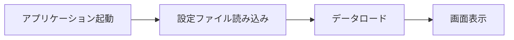

# my-dashboard

自分自身の日々の生活・活動をモニタリングするためのパーソナルダッシュボードツール

## 要求

## 設計

### 基本方針

- 1st リリースでは、TUI アプリケーションとして実装する

### 起動フロー

```mermaid
flowchart LR
  A["アプリケーション起動"] --> B["設定ファイル読み込み"]
  B --> C["データロード"]
  C --> D["画面表示"]
```
